## Case Description

This case study reproduces the **cold-flow field of the Sydney swirl burner** using a physics-informed neural network (PINN)-based approach. The Sydney swirl burner is a widely used benchmark configuration for studying swirling jet flows, recirculation zones, and turbulence-dominated flow structures under non-reactive and reactive conditions.

The present study focuses on the **non-reactive cold-flow condition**, where air is issued from the central jet at a prescribed velocity. Two representative swirl configurations are considered:

| Case    | Flow Type       | Jet Fluid | Jet Velocity | Swirl Number |
| ------- | --------------- | --------: | -----------: | -----------: |
| N16S159 | High swirl flow |       Air |       66 m/s |         1.59 |
| N29S054 | Low swirl flow  |       Air |       66 m/s |         0.54 |

The high-swirl case, **N16S159**, represents a strongly swirling jet condition and is expected to produce a more pronounced internal recirculation zone. In contrast, the low-swirl case, **N29S054**, has a weaker swirl intensity and therefore exhibits a different jet-spreading and recirculation behavior.

### Burner Configuration

The burner configuration and schematic are shown below.

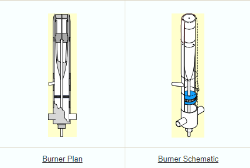

### Operating Conditions

The operating conditions for the two selected cold-flow cases are summarized below.

#### High Swirl Case: N16S159

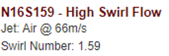

#### Low Swirl Case: N29S054

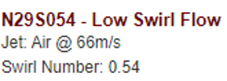

> References: **https://web.aeromech.usyd.edu.au/thermofluids/swirl.php**

## Methodology

This section describes the governing equations, PINN model structure, training strategy, and the distribution of residual and collocation points used for reproducing the cold-flow field of the Sydney swirl burner.

### Governing Equations

The cold-flow field is modeled using the conservation equations for a Newtonian fluid. The flow variables considered in this study are the three velocity components, density, and pressure:

$$
u = u(x,y,z,t),
$$

$$
v = v(x,y,z,t),
$$

$$
w = w(x,y,z,t),
$$

$$
\rho = \rho(x,y,z,t),
$$

$$
P = P(x,y,z,t).
$$

The momentum equations are written as:

$$
\frac{\partial \rho u}{\partial t}+ u\frac{\partial \rho u}{\partial x}+ v\frac{\partial \rho u}{\partial y}+ w\frac{\partial \rho u}{\partial z}+ \frac{\partial P}{\partial x}- \mu \left(\frac{\partial^2 u}{\partial x^2}+ \frac{\partial^2 u}{\partial y^2}+ \frac{\partial^2 u}{\partial z^2}\right)= 0,
$$

$$
\frac{\partial \rho v}{\partial t}+ u\frac{\partial \rho v}{\partial x}+ v\frac{\partial \rho v}{\partial y}+ w\frac{\partial \rho v}{\partial z}+ \frac{\partial P}{\partial y}- \mu \left(\frac{\partial^2 v}{\partial x^2}+ \frac{\partial^2 v}{\partial y^2}+ \frac{\partial^2 v}{\partial z^2}\right)= 0,
$$

$$
\frac{\partial \rho w}{\partial t}+ u\frac{\partial \rho w}{\partial x}+ v\frac{\partial \rho w}{\partial y}+ w\frac{\partial \rho w}{\partial z}+ \frac{\partial P}{\partial z}- \mu \left(\frac{\partial^2 w}{\partial x^2}+ \frac{\partial^2 w}{\partial y^2}+ \frac{\partial^2 w}{\partial z^2}\right)- \rho g= 0.
$$

The continuity equation is given by:

$$
\frac{\partial \rho}{\partial t}+ \frac{\partial \rho u}{\partial x}+ \frac{\partial \rho v}{\partial y}+ \frac{\partial \rho w}{\partial z}= 0.
$$

The dynamic viscosity of air is set as:

$$
\mu = 1.384 \times 10^{-5} \ \mathrm{kg/(m \cdot s)}
$$

for air at 298 K.

### Neural Network Structure

The PINN model takes the spatial and temporal coordinates as inputs:

$$
(x, y, z, t)
$$

and predicts the flow-field variables:

$$
(u, v, w, \rho, P).
$$

The general mapping of the neural network can be expressed as:

$$
(x, y, z, t) \rightarrow \mathrm{NN}_{\theta} \rightarrow (u, v, w, \rho, P),
$$

where $\theta$ represents the trainable parameters of the neural network.

The model structure is illustrated below.

#### Neural network structure used for predicting the velocity components, density, and pressure.

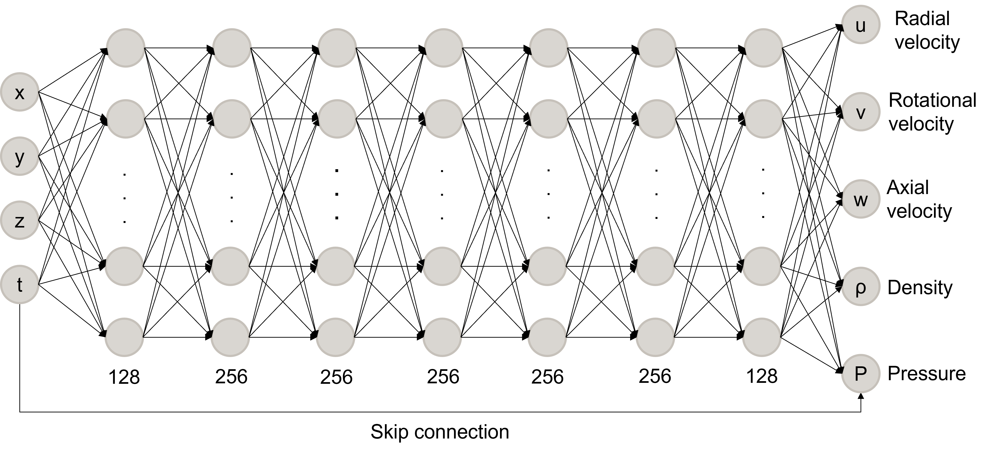

### Training Scheme

The training process combines the prediction of flow-field variables with the evaluation of physical residuals. The neural network first predicts the target flow variables. Then, automatic differentiation is used to compute the required temporal and spatial derivatives. These derivatives are substituted into the governing equations to evaluate the residuals of the momentum and continuity equations.

The residual terms are then included in the loss function to constrain the neural network prediction using the underlying fluid-dynamic equations.

The overall training workflow is shown below.

#### Training scheme of the physics-informed neural network.

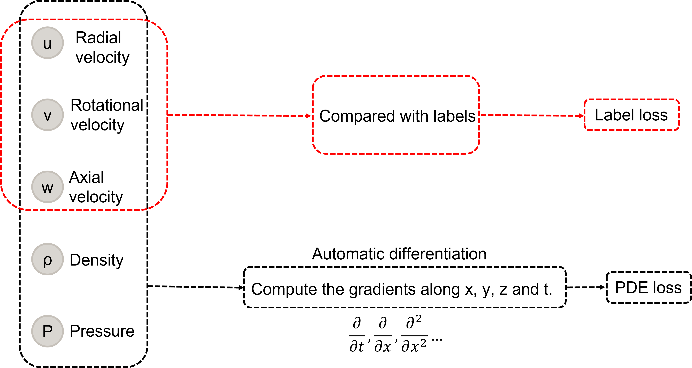

### Residual and Collocation Point Distribution

The residual and collocation points are distributed within the computational domain to enforce the experimental collections and governing equations at selected spatial and temporal locations. These points are used to evaluate the equation residuals during training and guide the network toward physically consistent solutions. As provided in the official supplimentary materials, there are 304 residual points where the experimental results are measured. Additionally, 2345 collocation points are added to learn the governing PDEs. 

The distribution of the training points is shown below.

#### Distribution of residual and collocation points used for PINN training.

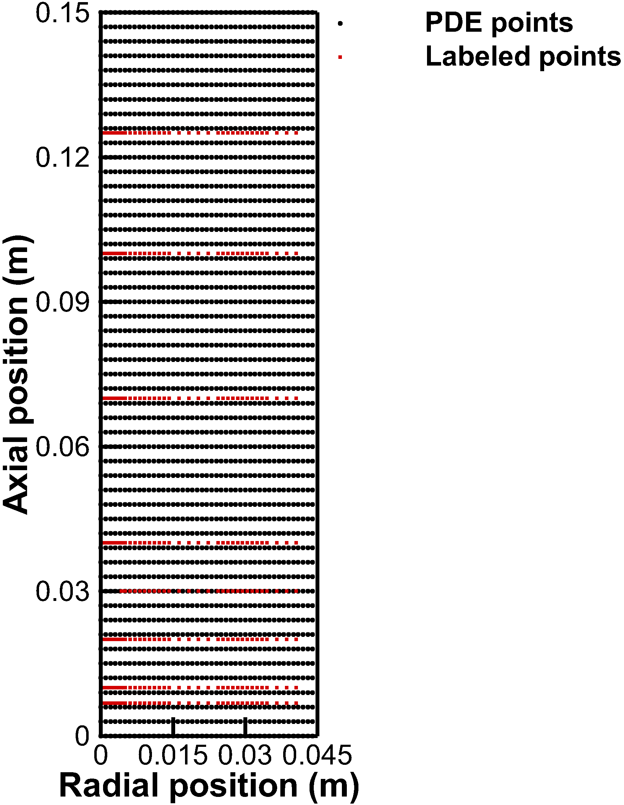

## Preliminary Results

### Countours of velocity magnitudes

<table>
  <tr>
    <td align="center">
      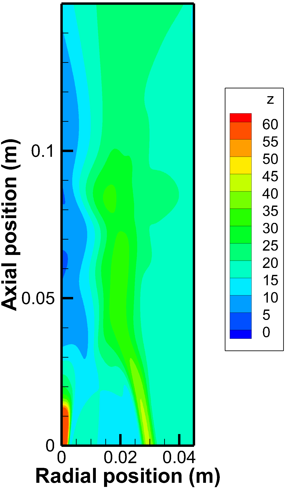 
      <b>(a) N29S054, low swirl</b>
    </td>
    <td align="center">
      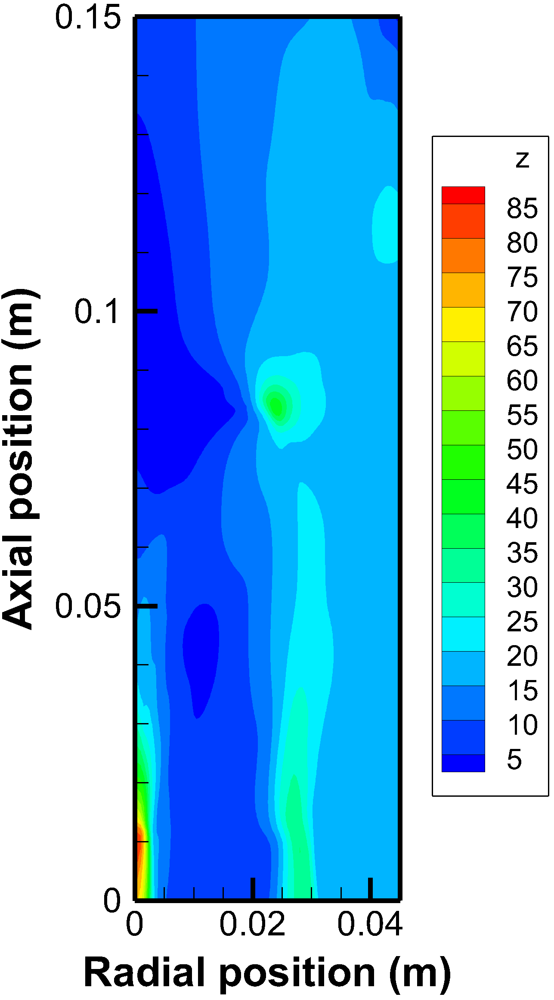 
      <b>(b) N16S159, high swirl</b>
    </td>
  </tr>
</table>

### Velocity Profiles in N29S054

<table>
  <tr>
    <td align="center">
      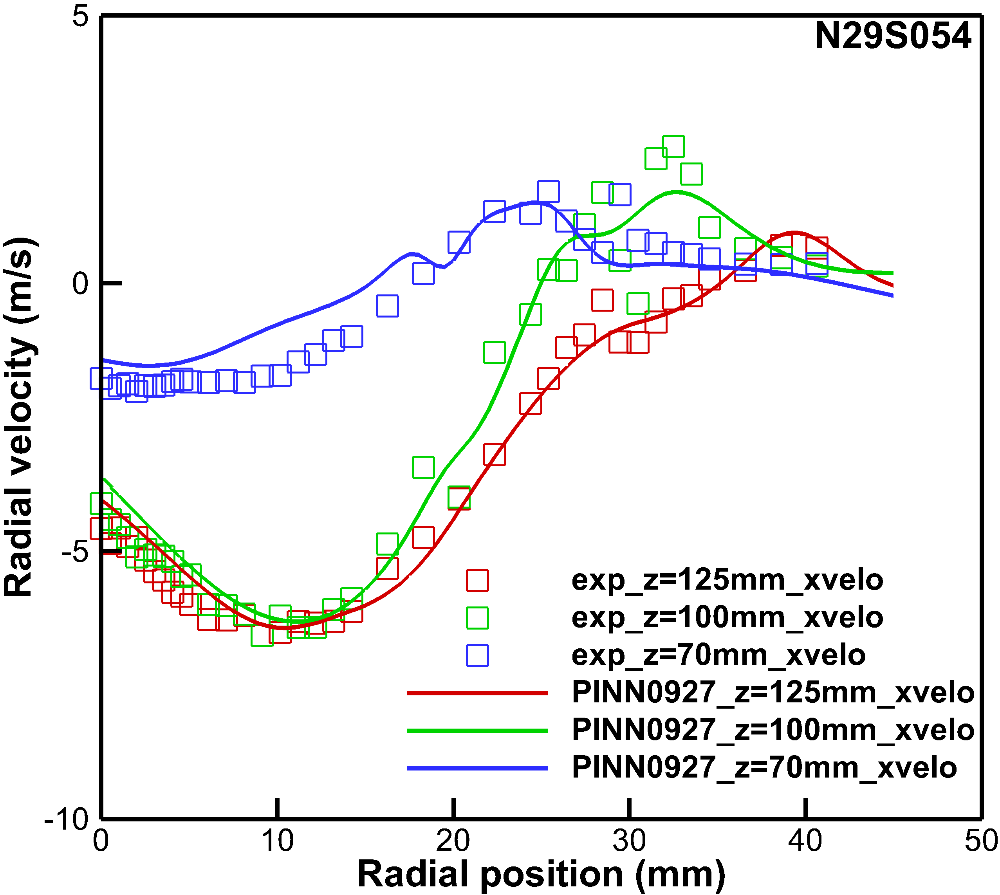 
      <b>(a) Radial velocity</b>
    </td>
    <td align="center">
      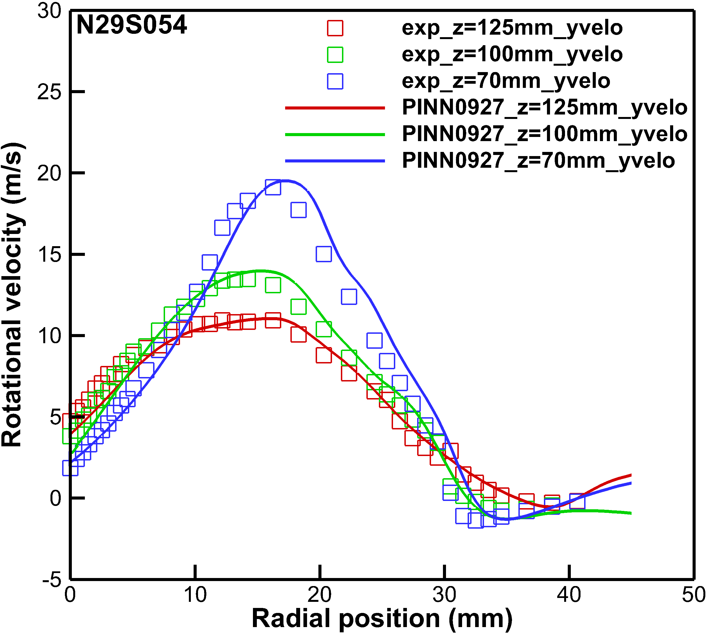 
      <b>(b) Rotational velocity</b>
    </td>
    <td align="center">
      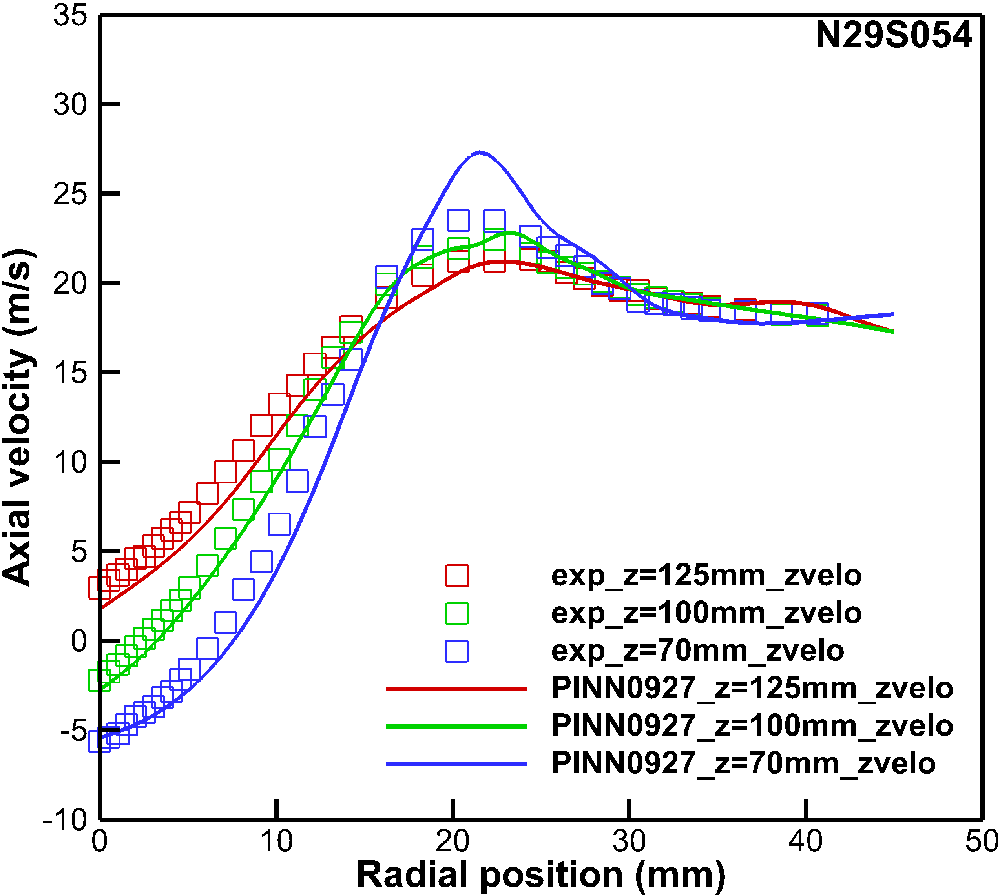 
      <b>(c) Axial velocity</b>
    </td>
  </tr>
</table>

### Velocity Profiles in N16S159

<table>
  <tr>
    <td align="center">
      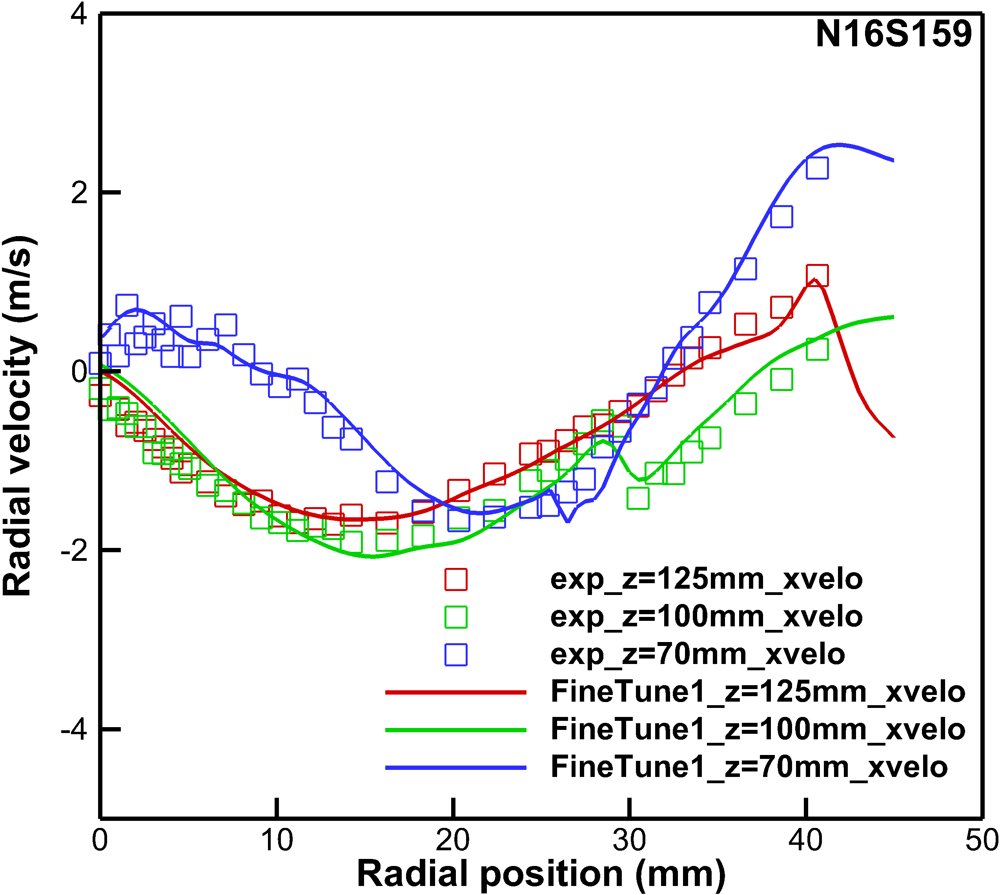 
      <b>(a) Radial velocity</b>
    </td>
    <td align="center">
      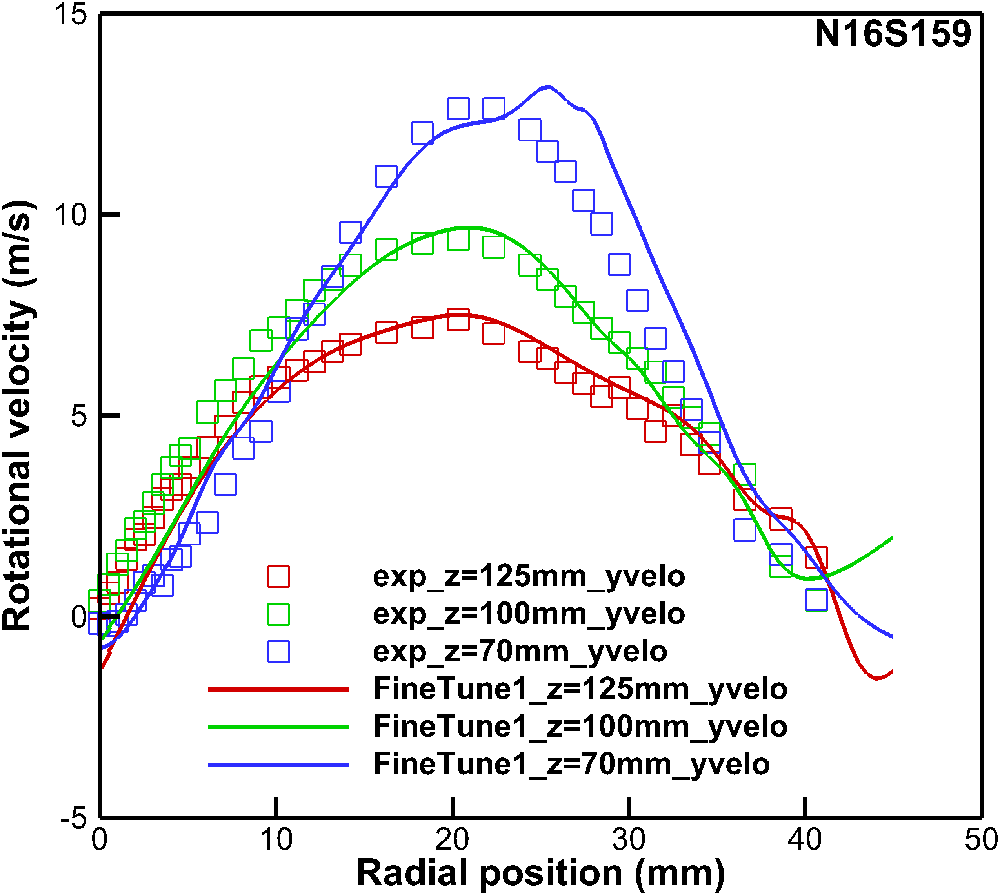 
      <b>(b) Rotational velocity</b>
    </td>
    <td align="center">
      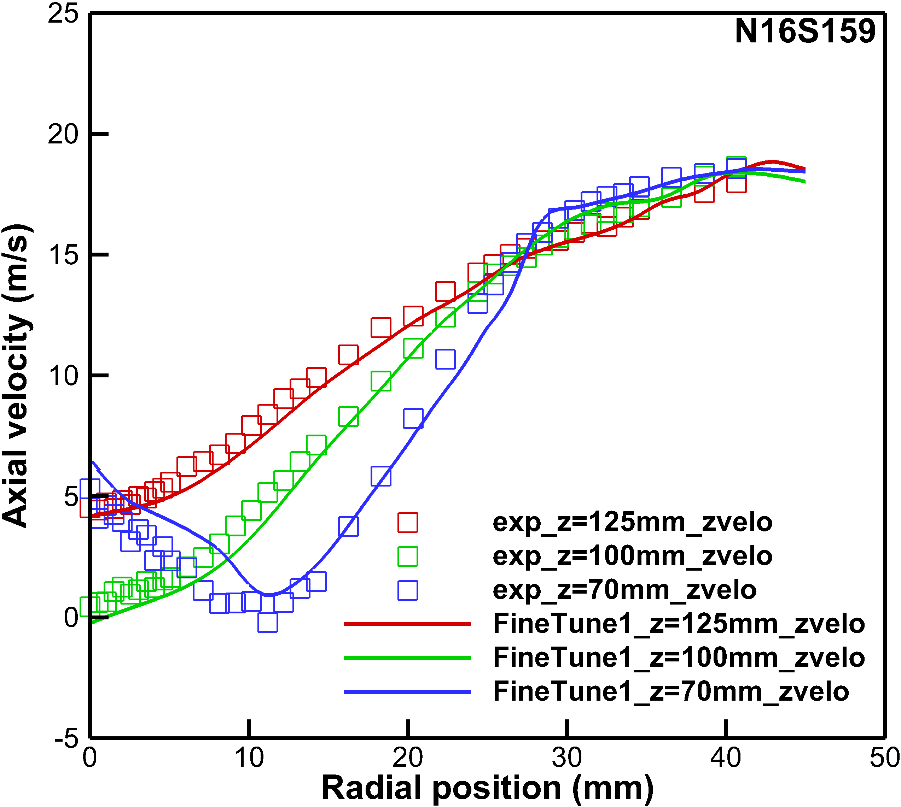 
      <b>(c) Axial velocity</b>
    </td>
  </tr>
</table>

The symbols indicate the experimental measurements while the solid lines represent the simulation conducted via the present trained models. 
